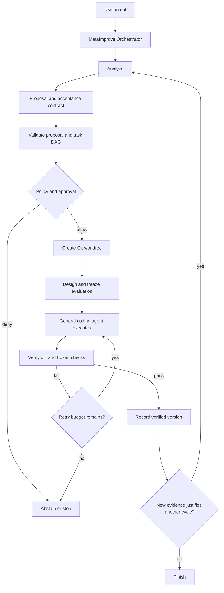

# Unified MetaImprove Agent Workflow

## 1. Purpose

This document proposes a unified workflow architecture for MetaImprove.

The central idea is:

> MetaImprove should have one deterministic orchestrator, use the general coding
> agent as its implementation worker, support autonomous and supervised governance,
> and improve code through bounded, evidence-driven recursive cycles.

The general coding agent should not need to understand the complete self-improvement
process. It receives a concrete coding task and works inside an isolated Git
worktree. The MetaImprove orchestrator owns analysis, policy, approval, versioning,
verification, and the decision to continue or stop.

## 2. Design Goals

The unified workflow should:

1. Replace the separate top-level orchestration loops with one orchestration model.
2. Reuse the existing ReAct coding agent as the implementation worker.
3. Support exactly two governance modes:
   - autonomous;
   - supervised, with a human in the loop.
4. Permit automatic recursive improvement, subject to explicit budgets and stop
   conditions.
5. Validate every LLM-generated task graph deterministically before execution.
6. Evaluate actual artifacts such as diffs and test results, rather than relying on
   a worker's textual summary.
7. Use Git commits, branches, and worktrees as the versioning and isolation system.
8. Keep final acceptance deterministic wherever executable checks are available.

## 3. High-Level Workflow

```text
User intent
    -> Analyze source, trajectories, evaluations, and current version
    -> Produce ImprovementProposal and acceptance contract
    -> Validate proposal and task DAG
    -> Apply policy and, in supervised mode, request human approval
    -> Create a Git branch and worktree from the pinned base commit
    -> Design and freeze the evaluation artifact
    -> Give concrete tasks to the general coding agent
    -> Evaluate the actual diff and run frozen checks
    -> Accept or reject the candidate version
    -> Decide whether new evidence justifies another improvement cycle
```

The corresponding control flow is:



## 4. One Orchestrator

"One orchestrator" means one component owns workflow state transitions, task
scheduling, failure propagation, approval checkpoints, version transitions, and
recursive-cycle decisions.

It does not mean one unconstrained LLM should act as planner, writer, reviewer,
policy engine, and final verifier. Deterministic control and LLM reasoning remain
separate.

A possible top-level interface is:

```python
class MetaImproveOrchestrator:
    analyzer: Analyzer
    code_agent: CodeAgent
    evaluator: EvaluationSystem
    policy: PolicyEngine
    approval: ApprovalProvider
    versions: GitVersionManager
    recursion: RecursionPolicy

    async def run(self, request: ImproveRequest) -> ImproveRun:
        ...
```

The existing `plan_execute`, multi-agent orchestrator, and improvement pipeline
should eventually become strategies or internal services of this orchestrator,
rather than independent top-level workflow loops.

## 5. General Coding Agent as the Worker

The existing ReAct coding agent should be the implementation engine used by
MetaImprove.

MetaImprove adds analysis and governance before it, and verification after it:

```text
MetaImprove = Analyze + Govern + General Code Agent + Verify + Recurse
```

The coding agent receives a normalized task such as:

```python
class CodeTask(BaseModel):
    id: str
    goal: str
    cwd: str
    dependencies: list[str]
    constraints: list[str]
    acceptance_criteria: list[AcceptanceCriterion]
    evidence: list[Evidence]
    editable_paths: list[str]
    denied_paths: list[str]
```

Its responsibility is limited to concrete implementation work:

```text
read -> reason -> call tools -> edit -> run checks -> report evidence
```

The coding agent does not decide whether its own version should be accepted or
whether MetaImprove should recurse again.

## 6. Two Governance Modes

The workflow supports exactly two user-facing governance modes.

```python
class GovernanceMode(StrEnum):
    AUTONOMOUS = "autonomous"
    SUPERVISED = "supervised"
```

### 6.1 Autonomous mode

The deterministic policy engine returns `allow` or `deny`. Allowed actions proceed
without asking a human. Denied actions stop, abstain, or fail according to the
workflow state.

Autonomous does not mean unrestricted. Path restrictions, command restrictions,
budgets, frozen evaluations, and acceptance gates still apply.

### 6.2 Supervised mode

The same policy engine runs first. Hard-denied actions remain denied. At configured
checkpoints, otherwise permitted actions require human approval.

Useful checkpoints include:

- approval of the improvement proposal;
- approval of protected-path changes;
- approval of unusually risky commands;
- approval before accepting or merging a verified version;
- approval before starting another recursive cycle.

### 6.3 Explicit approval providers

Governance must be explicit rather than inferred from whether an approval callback
happens to be present.

```python
class ApprovalProvider(Protocol):
    async def authorize(self, request: ApprovalRequest) -> ApprovalDecision:
        ...


class AutoApprovalProvider:
    """Uses policy decisions without prompting a human."""


class HumanApprovalProvider:
    """Uses policy decisions and prompts at supervised checkpoints."""
```

The same provider should be available throughout the run so that proposal approval,
tool execution, protected paths, merge decisions, and recursion follow consistent
rules.

## 7. Bounded Recursive Improvement

Automatic recursion should be modeled as a sequence of improvement cycles, not as
an unlimited LLM loop.

```python
class RecursionPolicy(BaseModel):
    max_cycles: int = 3
    max_failed_cycles: int = 1
    max_total_tokens: int = 200_000
    max_wall_time_seconds: int = 3600
    require_measurable_gain: bool = True
    stop_on_no_new_evidence: bool = True
```

Another cycle may begin only when new evidence shows that the original intent is
not yet fully satisfied. Examples include:

- a benchmark still misses its target;
- a trajectory exposes a remaining error;
- a required metric has improved but has not reached its threshold;
- a verified change exposes a new, directly related blocker;
- the previous cycle intentionally deferred a task required by the original goal.

The workflow must stop when:

- the original intent and required criteria are satisfied;
- there is no new evidence supporting another change;
- the expected gain is below policy thresholds;
- a hard policy rule denies continuation;
- the failure, token, time, or cycle budget is exhausted;
- supervised mode does not receive approval to continue.

The LLM should not be asked to invent another improvement merely to keep the loop
running.

## 8. Task DAG Validation and Execution

Every LLM-generated task graph must be validated before any task runs.

```python
class PlanValidationResult(BaseModel):
    valid: bool
    duplicate_ids: list[str]
    unknown_dependencies: list[str]
    cycles: list[list[str]]
    unreachable_tasks: list[str]
    criteria_without_tasks: list[str]
    tasks_without_criteria: list[str]
```

Validation must check at least:

- task IDs are non-empty and unique;
- every dependency references an existing task;
- the graph is acyclic;
- the graph contains at least one runnable root task;
- required acceptance criteria are assigned to tasks;
- tasks that can modify code have an allowed scope.

Runtime task states should be explicit:

```text
pending -> running -> completed
                   -> failed
pending            -> blocked
pending            -> skipped
```

If a task fails, dependent tasks should be marked `blocked` with the failed
dependency recorded. An empty runnable batch is successful only when every task is
completed or intentionally skipped. Otherwise it is a deadlock or blocked plan.

### 8.1 Concurrency

Read-only independent tasks may run concurrently. Tasks that write to the same
worktree should run serially unless the orchestrator can prove their declared write
sets do not overlap.

A future implementation may isolate parallel writers in separate worktrees and use
an integration step, but shared-worktree concurrent writing should not be the
default.

## 9. Evaluation Instead of a Summary-Only Reviewer

The current Reviewer and Test Agent overlap because both translate natural-language
requirements into quality judgments. They should be unified under an evaluation
subsystem, while preserving separation between evaluation design and final
acceptance.

```python
class EvaluationSystem:
    designer: EvaluationAgent
    verifier: DeterministicVerifier
```

### 9.1 Evaluation design before implementation

The Evaluation Agent should:

- translate acceptance criteria into generated tests, benchmarks, invariants, or
  manual checks;
- inspect real source interfaces before generating tests;
- reject criteria that are ambiguous or not verifiable;
- create an evaluation artifact;
- freeze and hash that artifact before product implementation begins.

### 9.2 Change review after implementation

The Evaluation Agent may also inspect:

- the actual diff;
- changed paths;
- tool and command results;
- test coverage gaps;
- structural risks not represented by generated tests.

It may produce structured findings and request another bounded implementation
round. It must not be the sole final acceptance authority.

### 9.3 Deterministic verification

The final verifier should execute and record:

- frozen generated tests;
- existing regression tests;
- lint and type checks defined by the target;
- before/after benchmarks;
- permission and changed-path checks;
- confirmation that the writer did not edit the frozen evaluation artifact;
- required acceptance-criterion outcomes.

Final acceptance should be derived from these results according to explicit rules.
An LLM review is supporting evidence, not the only hard gate.

### 9.4 Avoid correlated self-approval

It is acceptable to reuse the same implementation class or model provider for test
design and change review, but they should use separate phase contexts and frozen
artifacts. The component that designed a test must not be able to silently rewrite
that test after seeing the implementation.

## 10. Git-Based Versioning and Isolation

MetaImprove uses Git as the version system. A separate content-addressed snapshot
system is not required for the core workflow.

Git provides:

- a pinned base commit;
- an isolated branch;
- a separate worktree;
- stable checkpoints through commits;
- diffs and changed-path inspection;
- rollback and version comparison;
- optional merge into the user's branch.

Each improvement cycle should record:

```python
class ImprovementVersion(BaseModel):
    run_id: str
    cycle: int
    base_commit: str
    branch: str
    worktree_path: str
    evaluation_commit: str | None
    implementation_commits: list[str]
    verified_commit: str | None
    proposal_hash: str
    evaluation_hash: str
```

The version sequence should look like:

```text
V0 base
  -> V1 evaluation contract
  -> V1 implementation
  -> V1 verified
  -> V2 analysis based on verified V1
  -> V2 evaluation contract
  -> V2 implementation
```

Each recursive cycle should start from the previous cycle's verified commit and use
a new branch/worktree. It should not mutate one worktree indefinitely across all
cycles.

Only verified versions may become the base of the next cycle. Whether a verified
branch is merged into the user's active branch is a separate governance decision.

## 11. Runtime, Threads, and Runs

Conversation state and workflow state should be separate.

```python
class Thread(BaseModel):
    id: str
    messages: list[Message]
    events: list[Event]
    run_ids: list[str]


class ImproveRun(BaseModel):
    id: str
    thread_id: str | None
    intent: str
    governance_mode: GovernanceMode
    status: RunStatus
    current_cycle: int
    artifacts: list[ArtifactReference]
    versions: list[ImprovementVersion]
```

`Thread.messages` supplies model history for later turns. `Thread.events` is the UI
and audit stream. `ImproveRun` stores resumable workflow state, approvals, artifacts,
cycles, and Git versions.

A service restart should not erase active runs. Persistence may initially use
SQLite, with append-only events plus materialized run state.

## 12. Shared Run Context

Dependencies currently passed individually through many functions should be grouped
into a shared context.

```python
class RunContext:
    run_id: str
    cycle: int
    cwd: str
    client: LlmClient
    registry: ToolRegistry
    governance_mode: GovernanceMode
    policy: PolicyEngine
    approval: ApprovalProvider
    memory: MemoryManager | None
    code_index: CodeIndex | None
    event_sink: EventSink
    artifact_store: ArtifactStore
    budget: RunBudget
    cancellation: CancellationToken
```

This prevents plan, team, runtime, and improvement paths from accidentally omitting
approval, trajectory logging, memory, event collection, or budgets.

## 13. Suggested Orchestrator Algorithm

```python
async def run(request: ImproveRequest, ctx: RunContext) -> ImproveRun:
    current_commit = await versions.resolve_head(request.target)

    for cycle in recursion.iter_cycles(ctx.budget):
        cycle_ctx = ctx.for_cycle(cycle, current_commit)

        evidence = await analyzer.collect_evidence(
            intent=request.intent,
            commit=current_commit,
            ctx=cycle_ctx,
        )
        proposal = await analyzer.propose(request.intent, evidence, cycle_ctx)

        proposal_validation = validate_proposal(proposal)
        plan_validation = validate_task_dag(proposal.tasks)
        if not proposal_validation.valid or not plan_validation.valid:
            return run.blocked("invalid proposal or task graph")

        authorization = await authorize_proposal(proposal, cycle_ctx)
        if not authorization.allowed:
            return run.abstained(authorization.reasons)

        version = await versions.create_cycle_worktree(
            run_id=ctx.run_id,
            cycle=cycle,
            base_commit=current_commit,
        )

        evaluation = await evaluator.design(proposal, version, cycle_ctx)
        frozen = freeze(proposal, evaluation, version.base_commit)

        execution = await code_agent.execute_plan(
            proposal.tasks,
            frozen=frozen,
            cwd=version.worktree_path,
            ctx=cycle_ctx,
        )

        verification = await evaluator.verify(
            frozen=frozen,
            execution=execution,
            version=version,
            ctx=cycle_ctx,
        )

        if not verification.passed:
            retry = recursion.retry_decision(verification, cycle_ctx.budget)
            if retry.allowed:
                execution = await code_agent.repair(retry.findings, cycle_ctx)
                verification = await evaluator.verify(
                    frozen=frozen,
                    execution=execution,
                    version=version,
                    ctx=cycle_ctx,
                )
            if not verification.passed:
                return run.failed(verification)

        current_commit = await versions.record_verified(version, verification)

        continuation = recursion.should_continue(
            original_intent=request.intent,
            previous_evidence=evidence,
            verification=verification,
            budget=cycle_ctx.budget,
        )
        if not continuation.allowed:
            return run.completed(current_commit, continuation.reason)

        if ctx.governance_mode == GovernanceMode.SUPERVISED:
            approval = await ctx.approval.authorize(continuation.as_request())
            if not approval.allowed:
                return run.completed(current_commit, "human stopped recursion")

    return run.completed(current_commit, "recursion budget exhausted")
```

## 14. Proposed Module Boundaries

One possible package structure is:

```text
metaimprove/
  orchestration/
    orchestrator.py
    state_machine.py
    run_context.py
    task_executor.py
    plan_validator.py

  agent/
    code_agent.py
    query.py

  analysis/
    analyzer.py
    evidence.py
    proposal.py

  evaluation/
    designer.py
    verifier.py
    models.py
    runner.py

  governance/
    policy.py
    approval.py
    permissions.py
    budgets.py

  versioning/
    git_versions.py
    worktree.py

  runtime/
    threads.py
    runs.py
    events.py
    persistence.py

  tools/
  llm/
  memory/
  rag/
  mcp/
  entrypoints/
```

This is a target structure, not a requirement for a single large refactor. Existing
modules can be migrated incrementally.

## 15. Incremental Migration Plan

### Phase 1: Correctness foundations

1. Add deterministic task-DAG validation.
2. Add `blocked` propagation for failed dependencies and deadlock detection.
3. Make governance mode and approval provider explicit.
4. Ensure all tool execution paths receive the same policy and approval context.
5. Persist real thread message history across Runtime API turns.

### Phase 2: Unified execution kernel

1. Introduce `RunContext`.
2. Extract a reusable task-graph executor.
3. Configure serial or parallel scheduling as a policy.
4. Convert plan execution and team execution into executor configurations.
5. Make the improvement workflow use the same coding-agent worker interface.

### Phase 3: Unified evaluation

1. Replace summary-only review with artifact-based evaluation.
2. Unify Test Agent and Reviewer under `EvaluationSystem`.
3. Freeze the evaluation artifact before implementation.
4. Implement a deterministic final verifier.
5. Prohibit the writer from changing frozen evaluation files.

### Phase 4: Versioned recursive cycles

1. Add `ImprovementVersion` records.
2. Create a fresh branch/worktree per cycle.
3. Add explicit recursion budgets and stop conditions.
4. Allow only verified commits to seed the next cycle.
5. Persist runs so recursive work can be inspected and resumed.

### Phase 5: Remove obsolete orchestration paths

After behavior is covered by tests and migrated to the unified orchestrator:

1. remove duplicated plan/team loops;
2. remove implicit callback-based governance behavior;
3. retire unused snapshot code if Git versioning fully covers the intended use case;
4. update the README and design documentation to describe the implemented workflow.

## 16. Core Architectural Invariant

The intended boundary is:

> The general coding agent changes code. The MetaImprove orchestrator decides why a
> change is justified, whether it is allowed, how it must be verified, whether the
> candidate version is accepted, and whether another bounded improvement cycle is
> warranted.

This preserves autonomous recursive improvement without making the workflow an
unbounded self-approval loop.
